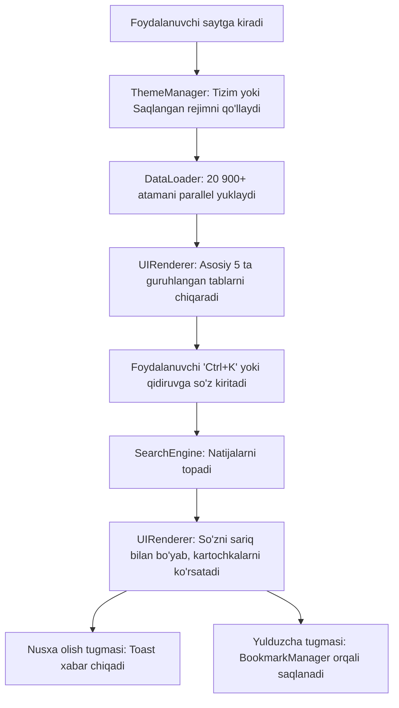

# MedLatin UZ - UI/UX Mukammallashtirish va Dizayn Tizimi
**Texnik Dizayn Hujjati (Design Specification)**  
**Sana**: 2026-10-06  
**Muallif**: MedLatin Dizayn & Muhandislik Jamoasi  
**Holat**: Ko'rib chiqish va tasdiqlash uchun tayyor  

---

## 1. Kirish va Maqsad

### 1.1 Muammo
MedLatin UZ 20 900+ dan ziyod boy ma'lumotlar bazasiga ega bo'lsa-da, uning hozirgi foydalanuvchi interfeysi (UI) va foydalanish tajribasi (UX) quyidagi kamchiliklarga ega:
1. **Kognitiv ortiqcha yuklama**: Qidiruv maydoni ostida 16 ta bir qatorda tizilgan filtrlash tugmalari mavjud bo'lib, foydalanuvchini chalg'itadi.
2. **Mavzu cheklovi**: Tungi (Dark) va Kunduzgi (Light) rejimlar orasida qo'lda o'tish imkoniyati yo'q (faqat tizim sozlamasiga bog'langan).
3. **Statik kartochkalar**: So'z kartochkalarida matnni nusxalash (Copy), shifokor tavsiyalarini saqlab qo'yish (Favorites/Bookmarks) va qidirilgan so'zni ajratib ko'rsatish (Highlight) mavjud emas.
4. **Vizual belgilar sifati**: Ikonalar cheklangan va emojilarga tayanilgan; tibbiy platforma uchun professional SVG ikonalar (Iconify) yetishmaydi.
5. **Retseptlar uchun xoslik yetishmasligi**: Dori retsepti qisqartmalari (`Rp.`, `D.t.d.N.`) oddiy suyak yoki a'zo kartochkasi kabi bir xil ko'rinadi.

### 1.2 Maqsad
MedLatin UZ platformasini zamonaviy, estetik jihatdan nufuzli, qulay va tibbiy jihatdan ishonchli (Medical Grade Design) PWA ilovasiga aylantirish.

---

## 2. Asosiy Yangiliklar va Imkoniyatlar (Features)

### 2.1 Tungi va Kunduzgi Mavzu (Dark & Light Theme Switcher)
* **Boshqaruv**: Header o'ng tomonida zamonaviy Quyosh/Oy tugmasi (`theme-toggle`).
* **Sinxronizatsiya**: 
  * Boshlang'ich holat: foydalanuvchining tizim afzalligidan (`prefers-color-scheme`) yoki `localStorage.getItem('medlatin_theme')` dan olinadi.
  * O'zgartirilganda: `document.documentElement` tegiga `data-theme="dark"` yoki `data-theme="light"` atributi o'rnatiladi.
  * Silliq ranglar almashinuvi: CSS o'zgaruvchilariga `transition: background-color 0.25s ease, color 0.25s ease` qo'llanadi.
* **Kontrast talabi (WCAG AA)**: Har ikkala mavzuda ham matn va orqa fon kontrasti minimal `4.5:1` bo'lishi kafolatlanadi.

### 2.2 Iconify Kutubxonasi Integratsiyasi (Professional SVG Ikonalar)
* **Kutubxona**: Iconify SVG Web Component (`iconify-icon`) integratsiyasi.
* **Offline PWA qo'llab-quvvatlash**: Iconify skripti `sw.js` (Service Worker) keshiga kiritiladi, internetsiz ham uzluksiz ishlaydi.
* **Ikonalar palitrasi**:
  * Qidiruv: `lucide:search`
  * Mavzu: `lucide:sun`, `lucide:moon`
  * Nusxa olish: `lucide:copy`, `lucide:check`
  * Tanlanganlar: `lucide:bookmark`, `lucide:bookmark-check`, `lucide:star`
  * Retsept: `solar:document-medicine-bold-duotone`
  * Anatomiya: `solar:health-bold-duotone`
  * Tozalash: `lucide:x`

### 2.3 Iyerarxik va Guruhlangan Filtrlar (Hierarchical Category Tabs)
Hozirgi 16 ta betartib tugma o'rniga 5 ta aniq asosiy toifa va pastki filtrlash chiplari (sub-chips) joriy etiladi:
1. **🌐 Barchasi** — Barcha 20 900+ atamalar.
2. **💊 Retseptlar & Dorilar** — Shifokor retsept qisqartmalari (35 ta eng zarur termin).
3. **🫀 Inson Anatomiyasi** — Tizimlar, sohalar, a'zolar, suyaklar, mushaklar, nervlar, tomirlar, bezlar, bo'g'imlar. (Tanlanganda pastida sub-filtrlash chiplari ochiladi).
4. **🩺 Klinik Tashxislar** — Kasalliklar, simptomlar va sindromlar.
5. **📖 Lotin Tili Leksikasi** — Otlar, sifatlar, fe'llar, ravishlar.
6. **⭐ Tanlanganlar** (yangi) — Foydalanuvchi saqlab qo'ygan xatcho'plar ro'yxati.

### 2.4 Qidiruv Tajribasi (Search UX & Micro-interactions)
* **Qidiruv matnini bo'yash (Highlight matching text)**: Foydalanuvchi so'z qidirganda (masalan, `aorta`), kartochkadagi mos kelgan harflar va so'zlar `<mark class="search-highlight">` orqali nafis oltin-sariq tusda ajratib ko'rsatiladi.
* **Tezkor klaviatura tugmasi**: `Ctrl + K` yoki `/` bosilganda kursorni to'g'ridan-to'g'ri qidiruv maydoniga yo'naltirish.
* **Mashhur so'rovlar (Discovery Chips)**: Qidiruv maydoni ostida ko'p qidiriladigan namunalar (`Rp.`, `D.t.d.N.`, `Aorta`, `Gastritis`, `Biceps`, `Cor`, `Yurak`). Bosilganda qidiruv avtomatik bajariladi.

### 2.5 Interaktiv Kartochkalar (Word Cards 2.0)
* **Bir bosishda nusxa olish (Copy to Clipboard)**: Har bir kartochkaning burchagida ixcham nusxa olish tugmasi. Bosilganda atama va uning o'zbekcha izohi xotiraga olinadi va ekranda 2 soniyali yengil "Nusxalandi" mini-toast xabari chiqadi.
* **Tanlanganlar (Bookmarks / Star)**: Atamani yulduzcha orqali `localStorage` ga saqlash. Foydalanuvchi xohlagan paytda o'zi belgilab olgan retseptlarini qayta ko'rishi mumkin.
* **Retseptlar uchun `Rx` vizual belgisi**: `prescription` kartochkalarida fon o'ng burchagida nafis yarim-shaffof klassik `℞` watermarking aks etadi.

### 2.6 Dinamik PWA Onlayn/Offlayn Ko'rsatkichi
* `window.navigator.onLine` hodisasi real vaqtda tinglanadi:
  * Internet ulanganda: Yashil chiroq + `Online (Kesh tayyor)`
  * Internet uzilganda: Zangori chiroq + `Offline rejim`

---

## 3. Texnik Arxitektura va Yangilanuvchi Fayllar

```
MedLatin-UZ/
│
├── index.html                   # Yangi header, theme-toggle, grouped tabs, discovery chips
├── manifest.json
├── sw.js                        # Yangi CSS/JS va Iconify kesh ro'yxati
│
├── css/
│   ├── variables.css            # Dark/Light kengaytirilgan tokenlar, data-theme selektorlari
│   ├── main.css                 # Yangi komponentlar ulanishi
│   ├── components/
│   │   ├── theme-toggle.css     # Quyosh/Oy tugmasi stillari
│   │   ├── search-bar.css       # Qidiruv qutisi, shortcut nishoni, chips
│   │   ├── filters.css          # Guruhlangan asosiy tablar va sub-chiplar
│   │   ├── word-card.css        # Yangi kartochkalar, highlight, copy, star, Rx watermark
│   │   └── toast.css            # "Nusxalandi" mini-toast bildirishnomasi
│
├── js/
│   ├── app.js                   # Asosiy controller (Shortcuts, Online/Offline, Events)
│   └── modules/
│       ├── theme-manager.js     # Dark/Light mavzuni boshqaruvchi yangi modul
│       ├── bookmark-manager.js  # Tanlanganlarni saqlovchi yangi modul (localStorage)
│       ├── search-engine.js     # Highlight helper funksiyasi bilan kengaytiriladi
│       └── ui-renderer.js       # Yangi kartochkalar, highlight, sub-filters rendering
│
└── tests/                       # Avtomatlashtirilgan testlar
    ├── validate-data.js
    ├── test-search.js
    └── test-theme-bookmarks.js  # Yangi modullar uchun testlar
```

---

## 4. Foydalanuvchi Tajribasi (Foydalanuvchi Oqimi / User Flow)



---

## 5. Muvaffaqiyat Mezonlari (Verification & Acceptance Criteria)

1. **Dizayn va Estetika**:
   * Tungi va kunduzgi rejim bir tugma orqali silliq almashadi va brauzer yopilib ochilganda ham saqlanib qoladi.
   * Ikonalar stiker/emoji emas, toza Iconify SVG formatida chiqadi.
   * Retsept kartochkalari o'ziga xos farmatsevtik `℞` watermarking bilan ajralib turadi.
2. **Qulaylik (UX)**:
   * 16 ta chalkash filtr o'rniga 5 ta asosiy toifa va zarurat bo'lganda ochiluvchi sub-chiplar ishlaydi.
   * Qidiruv so'zi kartochka ichida bo'yaladi (`<mark>`).
   * "Nusxa olish" tugmasi bir bosishda buferga nusxalaydi va toast chiqaradi.
   * "Yulduzcha" bosilganda atama saqlanadi va "Tanlanganlar" tabida ko'rinadi.
3. **Ishlash Tezligi va Barqarorlik**:
   * Barcha 23 ta data fayllar va yangi stillar offline rejimda ham xatosiz ishlaydi.
   * `npm test` barcha yangi testlar bilan birga to'liq `PASS` beradi.
